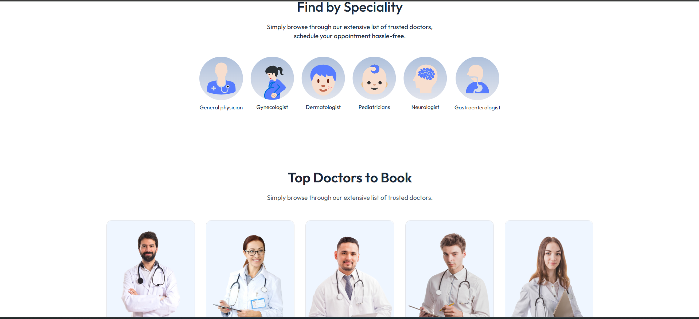
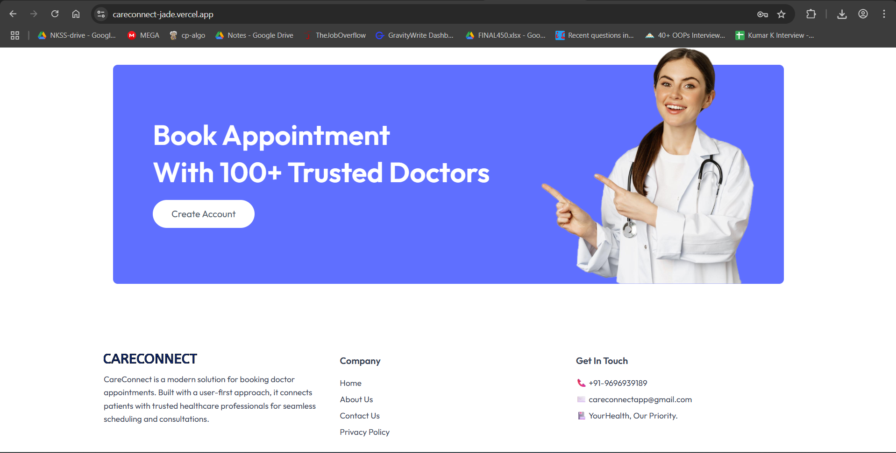
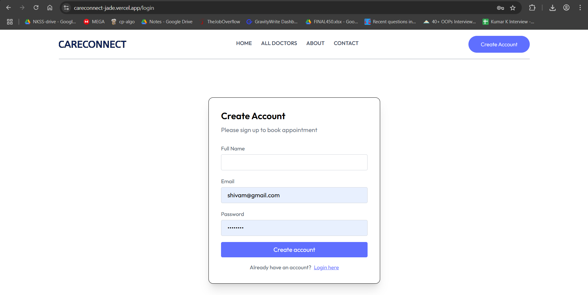
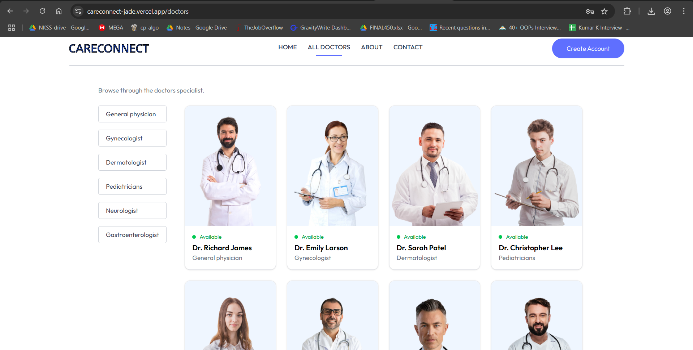

# 🩺 CARECONNECT – Doctor Appointment Booking System


**CareConnect** is a modern full-stack web application that allows users to book appointments with trusted doctors. It features a clean UI, admin panel for managing doctor availability, secure authentication, and real-time doctor listings.

---

## 🌐 Live Demo

**Frontend (User Side)**: [https://careconnect-jade.vercel.app](https://careconnect-jade.vercel.app)

---

## 📸 Screenshots

### 🔹 Homepage


### 🔹 Specialities & Top Doctors


### 🔹 Footer Section


### 🔹 Signup Page


### 🔹 All Doctors Page



---

## 🚀 Features

- 🔐 User Sign Up / Login with authentication
- 📅 Book appointments with doctors
- 🧑‍⚕️ Filter doctors by speciality
- ✅ Real-time availability status
- 🛠️ Admin panel to manage doctors
- 📊 Razorpay integration (if applicable)
- 📦 Fully responsive UI

---


## 🛠 Tech Stack

- **Frontend**: React.js, Tailwind CSS, Vite
- **Backend**: Node.js, Express.js
- **Database**: MongoDB Atlas
- **Authentication**: JWT
- **Admin Panel**: React + Vite
- **Deployment**: Vercel (Frontend/Admin), Render (Backend)

---

## ⚙️ Setup Instructions (Local)

### 1. Clone the Repository

```bash
git clone https://github.com/rajat-mish/CARECONNECT.git
cd CARECONNECT 
```
### 2. Frontend
```bash
cd Frontend
npm install
```

### 3. Backend
```bash
cd ../Backend
npm install
```

### 4. Admin
```bash
cd ../Admin
npm install
```

---
## 🔐 Configure Environment Variables
- Create a .env file in each directory (Frontend, Backend, Admin) with the following:
### 🔧 Backend .env
- PORT=5000
- MONGO_URL=your_mongodb_connection_string
- JWT_SECRET=your_jwt_secret
- CLOUDINARY_NAME=your_cloudinary_name
- CLOUDINARY_API_KEY=your_cloudinary_api_key
- CLOUDINARY_SECRET_KEY=your_cloudinary_secret
- ADMIN_EMAIL=your_admin_email
- ADMIN_PASSWORD=your_admin_password
- RAZORPAY_KEY_ID=your_razorpay_key
- RAZORPAY_KEY_SECRET=your_razorpay_secret
- CURRENCY=INR

### 🔧 Frontend .env
- VITE_BACKEND_URI=https://your-backend-url

### 🔧 Admin .env
- VITE_BACKEND_URI=https://your-backend-url

---
## ▶️ Run the Application
- Make sure MongoDB is running (locally or on Atlas).
### Start Backend
```bash
cd Backend
npm run dev
```
### Start Frontend
```bash
cd ../Frontend
npm run dev
```

### Start Admin Panel
```bash
cd ../Admin
npm run dev
```
---
## 👨‍💻 Author

**Rajat Mishra**  
[GitHub – rajat-mish](https://github.com/rajat-mish)


